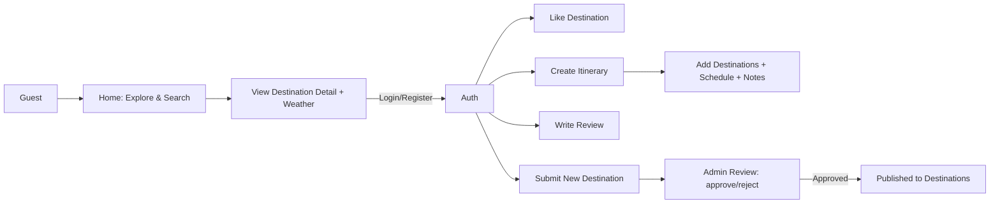
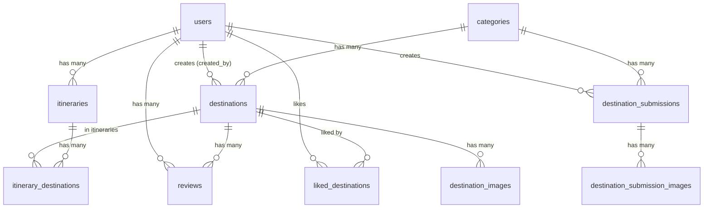
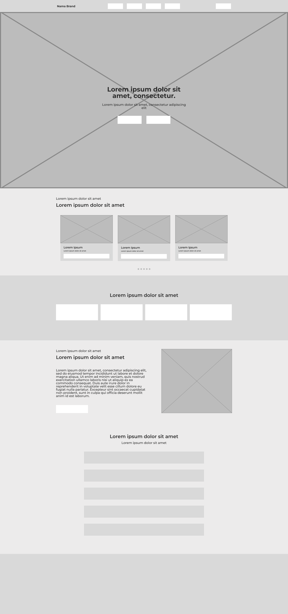
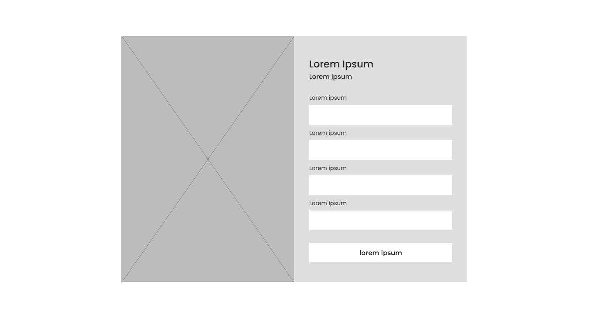
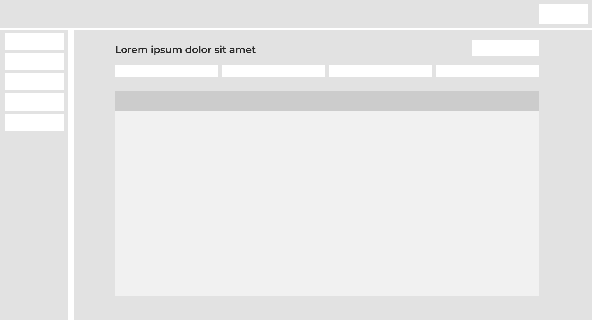
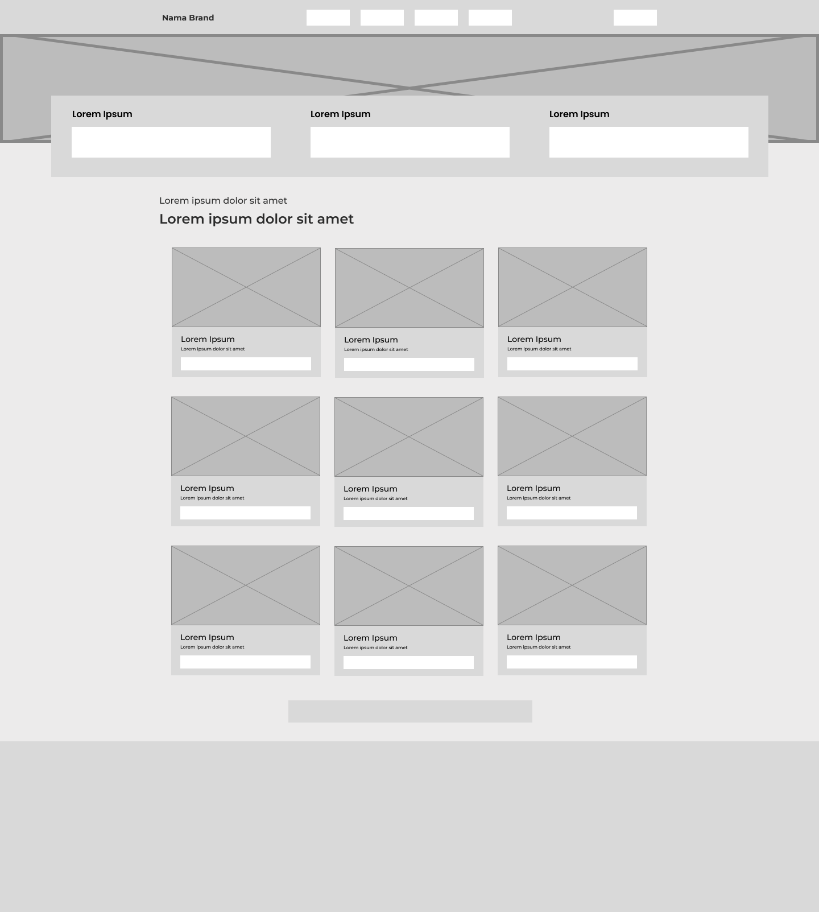
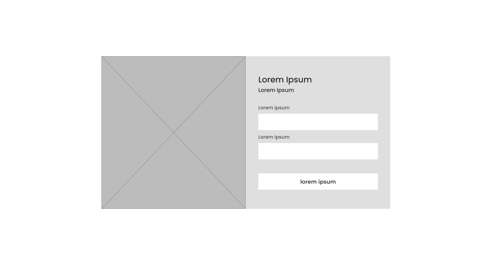

# Dokumentasi Proyek
## Nusatarawisata — Sistem Informasi Wisata Berbasis Cuaca

Nusatarawisata adalah platform web untuk menemukan destinasi wisata Indonesia, memantau cuaca real‑time di lokasi tujuan, menyimpan favorit, memberi ulasan, serta merencanakan perjalanan.

### Siapa target penggunanya?
- **Wisatawan umum**: mencari inspirasi tempat, mengecek cuaca, menyusun itinerary.
- **Travel planner/komunitas**: kurasi rute, berbagi rencana perjalanan.
- **Admin pengelola**: moderasi usulan destinasi dari pengguna dan mengelola data.

### 👥 Untuk Wisatawan
- Perencanaan perjalanan yang lebih efektif dengan informasi cuaca
- Akses mudah ke informasi destinasi wisata yang lengkap
- Pengalaman browsing yang menyenangkan dan intuitif

### 🏝️ Untuk Pariwisata Indonesia
- Promosi destinasi wisata lokal yang lebih efektif
- Peningkatan kesadaran masyarakat terhadap potensi wisata nusantara
- Kontribusi pada pertumbuhan sektor pariwisata daerah

### Fitur-fitur utama
- **Explorasi destinasi**: pencarian dan filter berdasarkan kategori/lokasi/nama, peta, detail destinasi.
- **Cuaca real‑time**: informasi prakiraan untuk membantu memilih waktu kunjungan.
- **Favorit (Like)**: simpan destinasi yang disukai.
- **Ulasan (Review)**: beri rating dan komentar destinasi.
- **Itinerary**: buat rencana perjalanan, atur urutan, waktu kunjung, dan catatan.
- **Usulkan destinasi**: kirim destinasi baru beserta foto untuk ditinjau Admin.
- **Dashboard Admin**: verifikasi usulan, kelola destinasi, kategori, dan pengguna.

### User flow (ringkas)


---
### User flow (kompleks)
```mermaid
flowchart TD
  %% Guest exploration
  subgraph G[Guest]
    GA[Home / Landing] --> GB[Explore: List Destinations]
    GB --> GC[Search & Filter\n(by name / category / location)]
    GC --> GD[Open Destination Detail]
    GD --> GE[Fetch Weather Info\n(OpenWeatherMap)]
    GE --> GD
    GD --> GF{Wants to like / review / plan?}
    GF -- No --> GG[Continue Browsing]
    GF -- Yes --> AH[Auth Gateway]
  end

  %% Auth gateway
  AH -->|Login/Register| AU[Authenticated]

  %% Authenticated user actions
  subgraph U[Authenticated User]
    AU --> U1[Like / Unlike Destination]
    AU --> U2[Write Review]
    U2 --> U2e[Edit / Delete Review]
    AU --> U3[Create Itinerary]
    U3 --> U3a[Add Destination to Itinerary]
    U3a --> U3b[Set Visit DateTime]
    U3b --> U3c[Order / Reorder Items]
    U3c --> U3d[Add Notes]
    U3d --> U3v[View / Share Itinerary]
    AU --> U4[Submit New Destination]
    U4 --> U4i[Upload Images]
    U4i --> U4s[Submit for Admin Review]
  end

  %% Admin moderation
  subgraph A[Admin]
    A0[Admin Login] --> A1[Review Submissions]
    A1 -->|Approve| A2[Create Published Destination\n(+ primary images)]
    A1 -->|Reject| A3[Write Admin Note]
    A2 --> A4[Visible in Public Catalog]
    A3 --> A5[Notify Submitter]
  end

  %% Navigation loops
  GG --> GB
  U1 --> GD
  U2e --> GD
  U3v --> GB
  U4s --> A1
  A4 --> GB

  %% Validation / errors (simplified)
  classDef warn fill:#FFF3CD,stroke:#E6C200,color:#000;
  V1[Validation Error]:::warn
  U2 --> V1
  U4i --> V1
  U3a --> V1
```
### 🔄 Alur Kerja Service Pattern:
1. **Controller** menerima HTTP request
2. **Controller** memanggil **Service** yang sesuai
3. **Service** mengeksekusi business logic
4. **Service** berinteraksi langsung dengan **Model** (Eloquent)
5. **Service** mengembalikan hasil ke **Controller**
6. **Controller** mengirim response ke user

## Database Schema Design

Di bawah ini ringkasan tabel, relasi, dan field berdasarkan berkas migrasi proyek.

### Entity-Relationship Diagram


### Tabel dan Field

1) `users`
- id, name, email (unique), password, image (nullable), status [active|inactive|banned] (default active), isAdmin (bool, default false), remember_token, timestamps

2) `sessions` (built-in Laravel session store)
- id (PK), user_id (nullable, index), ip_address, user_agent, payload, last_activity

3) `categories`
- id, name (unique), timestamps

4) `destinations`
- id
- created_by → FK `users.id`
- category_id → FK `categories.id`
- place_name, slug (unique), description
- administrative_area, province
- rating (decimal 3,2, default 0), rating_count (decimal, default 0)
- time_minutes, best_visit_time (nullable)
- latitude (decimal 10,8), longitude (decimal 11,8)
- timestamps

5) `destination_images`
- id
- destination_id → FK `destinations.id` onDelete(cascade)
- url, is_primary (bool, default false)
- timestamps

6) `itineraries`
- id
- user_id → FK `users.id` onDelete(cascade)
- title, slug (unique)
- startDate (date), endDate (date)
- status [completed|ongoing|draft] (default ongoing)
- timestamps

7) `itinerary_destinations`
- id
- itinerary_id → FK `itineraries.id` onDelete(cascade)
- destination_id (nullable) → FK `destinations.id` onDelete(cascade)
- visit_date_time (datetime)
- order_index (int)
- note (text, nullable)
- timestamps

8) `reviews`
- id
- user_id → FK `users.id` onDelete(cascade)
- destination_id → FK `destinations.id` onDelete(cascade)
- rating (int), comment (text, nullable)
- timestamps

9) `liked_destinations`
- id
- user_id → FK `users.id` onDelete(cascade)
- destination_id → FK `destinations.id` onDelete(cascade)
- timestamps

10) `destination_submissions`
- id
- created_by → FK `users.id` onDelete(cascade)
- category_id → FK `categories.id`
- place_name, description (text)
- administrative_area, province
- time_minutes, best_visit_time (nullable)
- latitude (decimal 10,8), longitude (decimal 11,8)
- status [pending|approved|rejected] (default pending)
- admin_note (text, nullable)
- timestamps

11) `destination_submission_images`
- id
- destination_submission_id → FK `destination_submissions.id` onDelete(cascade)
- url, timestamps

12) Infrastruktur (Laravel)
- `cache` (key PK, value, expiration)
- `cache_locks` (key PK, owner, expiration)
- `jobs` (antrian), `job_batches`, `failed_jobs`

### Catatan Relasi Utama
- User membuat banyak `destinations` (via `created_by`) dan banyak `destination_submissions`.
- `destinations` berada di dalam satu `category` dan memiliki banyak `destination_images`, `reviews`, `liked_destinations`, serta muncul pada banyak `itinerary_destinations`.
- `itineraries` dimiliki `user` dan berisi urutan kunjungan (`itinerary_destinations`).
- `reviews` dan `liked_destinations` menghubungkan `user` dengan `destination`.
- `destination_submissions` dan `destination_submission_images` mendukung proses moderasi sebelum publikasi.

---

### Mermaid Schema (detail fields)

```mermaid
classDiagram
  class users {
    +bigint id
    +string name
    +string email (unique)
    +string password
    +string image (nullable)
    +enum status [active|inactive|banned]
    +bool isAdmin (default false)
    +rememberToken
    +timestamps
  }

  class sessions {
    +string id (PK)
    +bigint user_id (nullable)
    +string ip_address(45) (nullable)
    +text user_agent (nullable)
    +longText payload
    +int last_activity
  }

  class categories {
    +bigint id
    +string name (unique)
    +timestamps
  }

  class destinations {
    +bigint id
    +bigint created_by (FK users)
    +bigint category_id (FK categories)
    +string place_name
    +string slug (unique)
    +text description
    +string administrative_area
    +string province
    +decimal rating(3,2) = 0
    +decimal rating_count = 0
    +int time_minutes
    +string best_visit_time (nullable)
    +decimal latitude(10,8)
    +decimal longitude(11,8)
    +timestamps
  }

  class destination_images {
    +bigint id
    +bigint destination_id (FK destinations) cascade
    +string url
    +bool is_primary = false
    +timestamps
  }

  class itineraries {
    +bigint id
    +bigint user_id (FK users) cascade
    +string title
    +string slug (unique)
    +date startDate
    +date endDate
    +enum status [completed|ongoing|draft]
    +timestamps
  }

  class itinerary_destinations {
    +bigint id
    +bigint itinerary_id (FK itineraries) cascade
    +bigint destination_id (FK destinations) cascade, nullable
    +dateTime visit_date_time
    +int order_index
    +text note (nullable)
    +timestamps
  }

  class reviews {
    +bigint id
    +bigint user_id (FK users) cascade
    +bigint destination_id (FK destinations) cascade
    +int rating
    +text comment (nullable)
    +timestamps
  }

  class liked_destinations {
    +bigint id
    +bigint user_id (FK users) cascade
    +bigint destination_id (FK destinations) cascade
    +timestamps
  }

  class destination_submissions {
    +bigint id
    +bigint created_by (FK users) cascade
    +bigint category_id (FK categories)
    +string place_name
    +text description
    +string administrative_area
    +string province
    +int time_minutes
    +string best_visit_time (nullable)
    +decimal latitude(10,8)
    +decimal longitude(11,8)
    +enum status [pending|approved|rejected]
    +text admin_note (nullable)
    +timestamps
  }

  class destination_submission_images {
    +bigint id
    +bigint destination_submission_id (FK destination_submissions) cascade
    +string url
    +timestamps
  }

  class cache {
    +string key (PK)
    +mediumText value
    +int expiration
  }

  class cache_locks {
    +string key (PK)
    +string owner
    +int expiration
  }

  class jobs {
    +bigint id
    +string queue (index)
    +longText payload
    +unsignedTinyInteger attempts
    +unsignedInteger reserved_at (nullable)
    +unsignedInteger available_at
    +unsignedInteger created_at
  }

  class job_batches {
    +string id (PK)
    +string name
    +int total_jobs
    +int pending_jobs
    +int failed_jobs
    +longText failed_job_ids
    +mediumText options (nullable)
    +int cancelled_at (nullable)
    +int created_at
    +int finished_at (nullable)
  }

  class failed_jobs {
    +bigint id
    +string uuid (unique)
    +text connection
    +text queue
    +longText payload
    +longText exception
    +timestamp failed_at (current)
  }

  %% Relationships
  users "1" --> "*" itineraries
  users "1" --> "*" reviews
  users "1" --> "*" liked_destinations
  users "1" --> "*" destinations : created_by
  users "1" --> "*" destination_submissions : created_by

  categories "1" --> "*" destinations
  categories "1" --> "*" destination_submissions

  destinations "1" --> "*" destination_images
  destinations "1" --> "*" reviews
  destinations "1" --> "*" liked_destinations
  destinations "1" --> "*" itinerary_destinations

  itineraries "1" --> "*" itinerary_destinations

  destination_submissions "1" --> "*" destination_submission_images
```


### Sekilas Alur Penggunaan (End-to-End)
1. Pengguna eksplor destinasi dan melihat cuaca tujuan.
2. Login/registrasi untuk menyukai, mengulas, dan membuat itinerary.
3. Susun itinerary: tambah destinasi, set waktu kunjung, urutan, dan catatan.
4. Kirim usulan destinasi baru (opsional) → Admin meninjau → bila disetujui, destinasi terpublikasi.


# Mockup - Low Fidelity Nusatarawisata

### Halaman Beranda


### Halaman Registrasi


### Halaman Dashboard


### Halaman Destinasi


### Halaman Login


### Halaman Tentang Kami


### Halaman Board Destinasi


